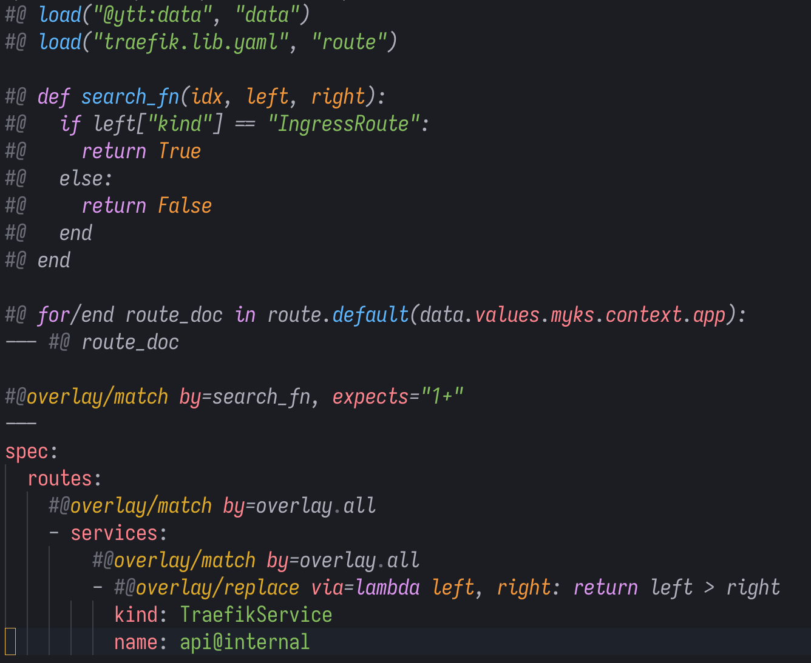
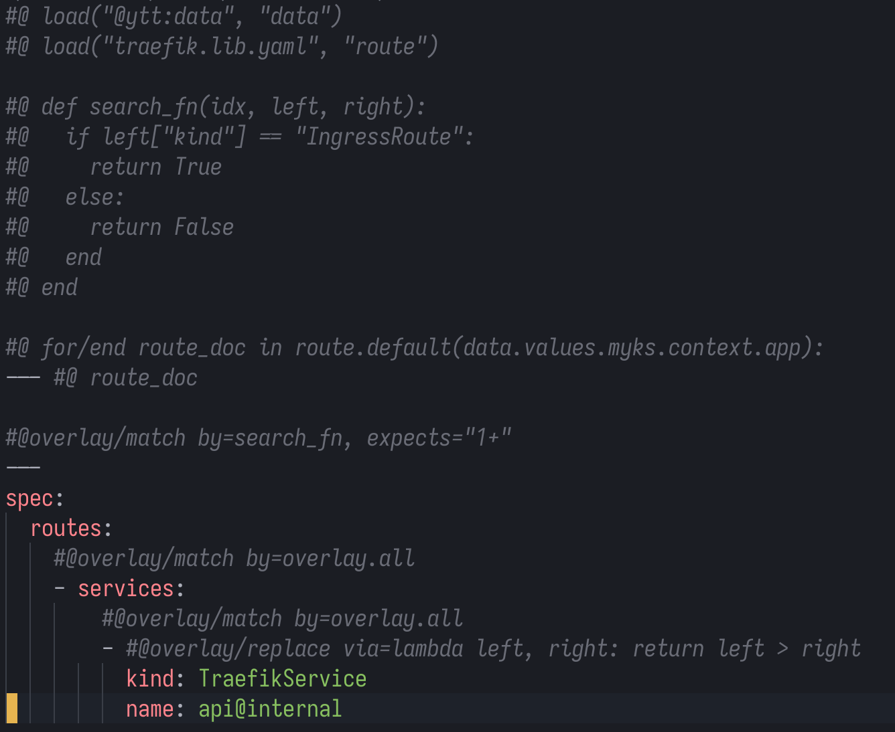

# YTT Annotation grammar for Tree-Sitter

This repository provides a [YTT](https://carvel.dev/ytt) (YAML Templating Tool) annotation grammar for [tree-sitter](https://tree-sitter.github.io/tree-sitter/), enabling syntax highlighting and parsing of YTT annotations within YAML files. It can be installed as a Neovim plugin with almost no configuration.

## Features

- Syntax highlighting for YTT annotations and Starlark code in YAML files.
- Easy integration with Neovim via the `nvim-treesitter` plugin.

<p align="center">
  <a href="hl-on.png" target="_blank"></a>
  <a href="hl-off.png" target="_blank"></a>
</p>

## Installation

This particular configuration is for AstroNvim4,
but it should be similar for other Neovim setups that support Tree-Sitter.

When in doubt, refer to the [nvim-treesitter documentation](https://github.com/nvim-treesitter/nvim-treesitter#adding-custom-languages).

```lua
return {
  {
    "zebradil/tree-sitter-ytt_annotation",
    dependencies = { "nvim-treesitter/nvim-treesitter" },
    ft = { "yaml" },
  },
}
```
